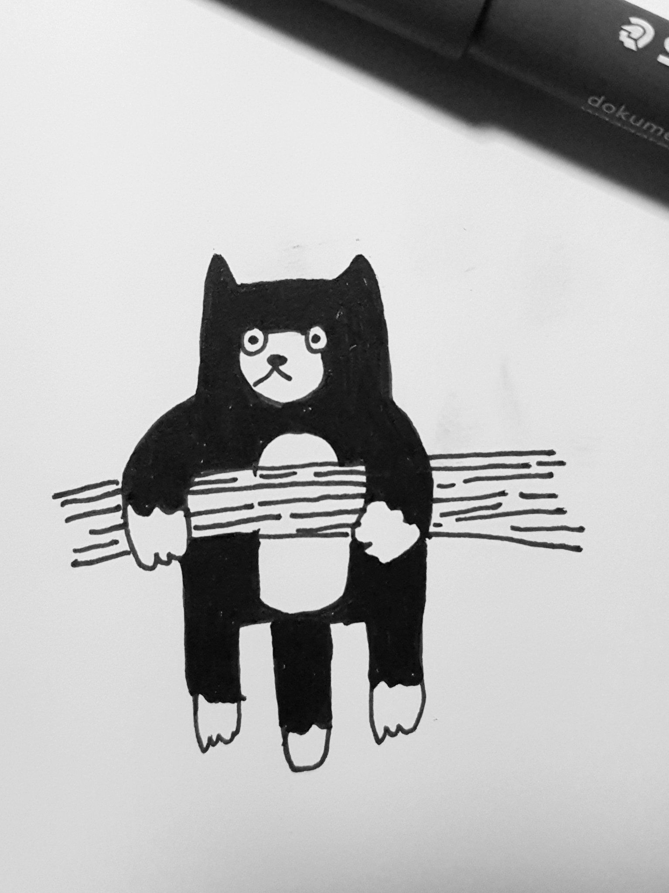

This is the first post on my new blog! I'm excited to see where this site will go if I put the time in it to post. The truth is I've never been great at adding content to a site. I spent a lot of a time as a kid in the late 90's and early 2000's making websites for different interests, but I was always looking towards building the next site then maintaining what I already had.

Unfortunately I have no idea where I could find the files for any of those sites if they still exists. Certainly my old Angelfire site I built when I was about 12 is gone. I don't remember the URL, and all my searches for it over the years have turned up nothing. So those are gone, and in fact, this site is a replacement for _two_ old sites of mine. A neglected Wordpress blog (w/ a custom theme I made quite a while ago), and my old personal landing page.

So I'm not much of a writer. At least I am a decent typist from all of the coding I've done over the years. I'm just going to try to hang on to this site for a little while and see what I can do!

This site has been build with Gatsby, which is new to me. So far I have loved the experience. I have plans to write up a blog post on my initial thoughts on using Gatsby so look out for that.
